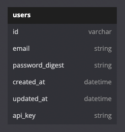

# Sweater Weather API


## Table of Contents
- [Background](#background)
- [Schema](#schema)
- [Endpoints](#endpoints)
- [Requirements](#requirements)
- [Setup](#setup)
- [Contributors](#contributors)

## Background

**Sweater Weather API** consumes external API services and exposes endpoints for a weather application frontend.

This Rails Api is the final solo project during MOD 3 at [Turing School of Software and Design](https://www.turing.edu)

For a complete break down of the project and its details and requirements, please follow this link:
[Whether, Sweater?](https://backend.turing.edu/module3/projects/sweater_weather/)

Features:
 - Basic authentication for user registration and login.
 - Issuing a required API key upon registration.
 - Search current, 5 day, and next 8 hours weather forecasts for a location in one call.
 - Plan a road trip between two locations. Receive estimated travel time and a weather report for the destination based on ETA.

The external services consumed are:
 - [OpenWeather One Call API](https://openweathermap.org/api/one-call-api)
 - [MapQuest Geocoding API](https://developer.mapquest.com/documentation/geocoding-api)
 - [MapQuest Directions API](https://developer.mapquest.com/documentation/directions-api)

## Database Schema



<p align="right">(<a href="#top">back to top</a>)</p>

## Endpoints

- Search weather forecast by location
```shell
GET /api/v1/forecast?location=denver,co
```
---
```
{
  "data": {
      "id": "null",
      "type": "forecast",
      "attributes": {
          "current_weather": {
              "datetime": "2022-08-09T17:33:35.000-06:00",
              "sunrise": "2022-08-09T04:53:09.000-06:00",
              "sunset": "2022-08-09T18:45:01.000-06:00",
              "temperature": 86.5,
              "feels_like": 95.85,
              "humidity": 69,
              "uvi": 0.13,
              "visibility": 10000,
              "conditions": "broken clouds",
              "icon": "04d"
          },
          "daily_weather": [
              {
                  "date": "2022-08-09",
                  "sunrise": "2022-08-09T04:53:09.000-06:00",
                  "sunset": "2022-08-09T18:45:01.000-06:00",
                  "max_temp": 88.27,
                  "min_temp": 71.28,
                  "conditions": "moderate rain",
                  "icon": "10d"
              },
              {
                  "date": "2022-08-10",
                  "sunrise": "2022-08-10T04:54:03.000-06:00",
                  "sunset": "2022-08-10T18:43:51.000-06:00",
                  "max_temp": 84.27,
                  "min_temp": 70.61,
                  "conditions": "moderate rain",
                  "icon": "10d"
              },
              {
                  "date": "2022-08-11",
                  "sunrise": "2022-08-11T04:54:56.000-06:00",
                  "sunset": "2022-08-11T18:42:41.000-06:00",
                  "max_temp": 85.3,
                  "min_temp": 67.62,
                  "conditions": "clear sky",
                  "icon": "01d"
              },
              {
                  "date": "2022-08-12",
                  "sunrise": "2022-08-12T04:55:49.000-06:00",
                  "sunset": "2022-08-12T18:41:29.000-06:00",
                  "max_temp": 81.01,
                  "min_temp": 63.91,
                  "conditions": "few clouds",
                  "icon": "02d"
              },
              {
                  "date": "2022-08-13",
                  "sunrise": "2022-08-13T04:56:43.000-06:00",
                  "sunset": "2022-08-13T18:40:16.000-06:00",
                  "max_temp": 81.3,
                  "min_temp": 58.33,
                  "conditions": "clear sky",
                  "icon": "01d"
              }
          ],
          "hourly_weather": [
              {
                  "time": "17:00:00",
                  "temperature": 85.71,
                  "conditions": "light rain",
                  "icon": "10d"
              },
              {
                  "time": "18:00:00",
                  "temperature": 86.5,
                  "conditions": "broken clouds",
                  "icon": "04d"
              },
              {
                  "time": "19:00:00",
                  "temperature": 84.61,
                  "conditions": "broken clouds",
                  "icon": "04n"
              },
              {
                  "time": "20:00:00",
                  "temperature": 82.29,
                  "conditions": "light rain",
                  "icon": "10n"
              },
              {
                  "time": "21:00:00",
                  "temperature": 79.52,
                  "conditions": "light rain",
                  "icon": "10n"
              },
              {
                  "time": "22:00:00",
                  "temperature": 76.8,
                  "conditions": "light rain",
                  "icon": "10n"
              },
              {
                  "time": "23:00:00",
                  "temperature": 73.98,
                  "conditions": "light rain",
                  "icon": "10n"
              },
              {
                  "time": "00:00:00",
                  "temperature": 73.54,
                  "conditions": "light rain",
                  "icon": "10n"
              }
          ]
      }
  }
}
```

- Register User
```shell
POST api/v1/users
Content-Type: application/json
Accept: application/json
body: {
    "email": "email@email.com",
    "password": "password",
    "password_confirmation": "password"
}
```
---
```
{
    "data": {
        "id": "1",
        "type": "users",
        "attributes": {
            "email": "email@email.com",
            "api_key": "A Valid API Key"
        }
    }
}
```

- Login User
```shell
POST api/v1/sessions
Content-Type: application/json
Accept: application/json
body: {
    "email": "email@email.com",
    "password": "password"
}
```
---
```
{
    "data": {
        "id": "1",
        "type": "users",
        "attributes": {
            "email": "email@email.com",
            "api_key": "A Valid API Key"
        }
    }
}
```

- Road Trip
```shell
POST /api/v1/road_trip
Content-Type: application/json
Accept: application/json
body: {
    "origin": "Denver,CO",
    "destination": "Pueblo,CO",
    "api_key": "A Valid API Key"
}
```
---
```
{
    "data": {
        "id": "null",
        "type": "roadtrip",
        "attributes": {
          "start_city": "Denver, CO",
          "end_city": "Pueblo, CO",
          "travel_time": "1 hour(s), 45 minute(s)",
          "weather_at_eta": {
              "temperature": 93.15,
              "conditions": "clear sky"
            }
        }
    }
}
```

<p align="right">(<a href="#top">back to top</a>)</p>

## Requirements

### API
[OpenWeather One Call API](https://openweathermap.org/api/one-call-api) follow instructions to get API key for v2.5.

[MapQuest Geocoding API](https://developer.mapquest.com/documentation/geocoding-api) follow instructions to get API key.

[MapQuest Directions API](https://developer.mapquest.com/documentation/directions-api) you only need the one key for MapQuest.

<p align="right">(<a href="#top">back to top</a>)</p>

## Setup
1. Clone this repository on your local machine.

2. Install required Gems utilizing Bundler: <br>
- In terminal, use Bundler to install any missing Gems. If Bundler is not installed, first run the following command.
```shell
$ gem install bundler
```

- If Bundler is already installed or after it has been installed, run the following command.
```shell
$ bundle install
```

3. Database Migration<br>
- Before using the web application you will need to setup your databases locally by running the following command
```shell
$ rails db:{drop,create,migrate}
```
4. Setup Figaro
```shell
$ bundle exec figaro install
```
- That will create an `config/application.yml` file.

- Add your api keys to new this new file.
```shell
#config/application.yml
  mapquest_api_key: <your mapquest key here>
  openweather_api_key: <your open weather key here>
```

5. Startup and Access<br>
- Start the server locally.

- Start server
```shell
$ rails s
```

<p align="right">(<a href="#top">back to top</a>)</p>

## Contributors
|  | |
| --- | --- |
| Zac Hazelwood | [GitHub](https://github.com/ZacHazelwood) &#124; [LinkedIn](https://www.linkedin.com/in/zac-hazelwood-0a48ab237/) |

<p align="right">(<a href="#top">back to top</a>)</p>
